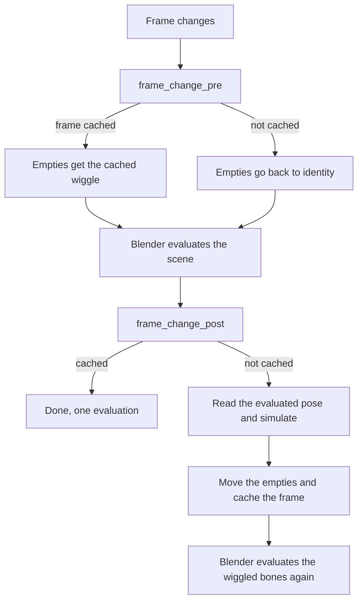
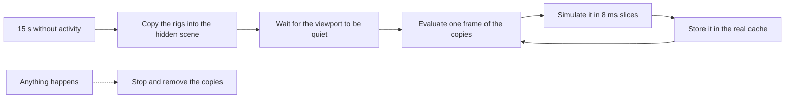

# Emil's Wiggle

My own take on [Wiggle 2](https://github.com/shteeve3d/blender-wiggle-2) by Steve Miller. Same spring physics on bones, but it works live in renders (no more baking just to hit F12), it's a LOT faster, and you can tweak or freeze each axis.

It started because the ears and tail on Kita'vali kept doing weird stuff. First the timing was off, then renders didn't match the viewport, and then muting every armature still somehow ate a third of my framerate xD So yeah, I took it apart.

Built for **Blender 3.6 LTS**. 

## Install

Run `python tools/build_zip.py` (or just zip the `EmilsWiggle` folder, Blender doesn't care about the extra stuff), then Edit > Preferences > Add-ons > Install and turn on **Emil's Wiggle**. You'll find it in the 3D View sidebar, in the **Emil** tab.

If Wiggle 2 is still installed, turn it off. The panel warns you when both are on for the same scene, since two sims fighting over the same bones isn't fun. Heads up though, Wiggle 2 doesn't clean up after itself when you turn it off while Blender is open (it leaves properties pointing at stuff that doesn't exist anymore, which can crash Blender later). Emil's Wiggle removes those leftovers by itself (right when Wiggle 2 gets turned off, and again before every save, since a leftover can crash saving a file with library overrides), but restarting Blender once after turning Wiggle 2 off is still the safest.

Got a file that already uses Wiggle 2? There's an **Import Wiggle 2 Settings** button. It shows up by itself when the file has Wiggle 2 bones, and it copies everything over (stiffness, colliders, head/tail, mutes...) and switches Wiggle 2 off for that scene.

## Using it

Pretty much like Wiggle 2. Turn the scene on, select an armature, pick a pose bone and tick **Tail** (the bone swings) or **Head** (the bone moves, only on bones that aren't connected). Changing a value changes it on every selected bone too, you can turn that off in Utilities.

Then just hit play.

### Per axis values and locks

Every Tail/Head section has a **Per Axis** toggle. Turn it on and Stiff, Damp and Gravity become X/Y/Z values in the bone's local space (it starts from whatever single value you had, so nothing jumps).

**Lock Axis** freezes motion along a local axis. For a tail that's X and Z (Y is along the bone, that's what Stretch is for). So an ear that should only flop sideways? Lock one axis and done. Turn on the bone axes display in the armature properties if you're not sure which one is which, bone roll decides it.

### Rendering without baking

This is the big one. F12, Ctrl+F12 and command line renders all run the wiggle for real now, and they match the viewport exactly.

The easy way: play your animation once (or click **Simulate Range**), then render. Every simulated frame is cached, so the render just reuses them, and a single F12 on frame 87 shows exactly what you saw on frame 87. If a frame isn't cached, an animation render simulates it on the spot, frame after frame.

Or don't even do that: leave Blender alone for 15 seconds and the **Background Cache** fills in the frames that aren't cached yet by itself (more on that in Speed stuff).

**Lock Cache** keeps the cached frames even if you edit stuff afterwards. Simulate Range locks it for you. When the cache is unlocked, editing the animation, the rig or a collider, or changing the frame rate or gravity clears it, so you never render something stale.

Wiggle turns on **Render > Lock Interface** when you enable a scene, and the panel yells if it gets turned off. Keep it on, it stops the viewport from touching the scene while the render thread moves bones.

**Bake to Keyframes** is still there in Utilities if you want real keys (for exporting, say), it's just not needed for renders anymore.

### Loops

**Loop Physics** is off by default. Turn it on and the sim keeps going when the timeline wraps around instead of snapping back. Once a loop plays out the same as the one before, playback just replays the cache from then on, so a settled loop costs almost nothing. **Preroll** runs some frames before the start so things are already settled, and with Loop Physics it prerolls the end of your loop, which is what you want for seamless cycles. A preroll stops early once the bones don't move anymore, so a big number doesn't cost much on springy stuff that settles fast.

### Speed stuff

**Fast Preview** (on by default) is for viewport playback. It shows each frame's wiggle one frame late, and in exchange Blender only has to evaluate your scene once per frame instead of twice. The physics itself is still exact, and paused frames, scrubbing to cached frames and renders are always exact too. You won't notice the delay on ears and hair, honestly. If a rig can't do it (other constraints on the wiggle chain, bones that don't inherit rotation or scale fully), it uses the normal mode, and the Simulation & Cache panel tells you which bone is the reason.

Careful, **Fast Preview doesn't change the physics time** in the Debug panel, that number is only the Python physics. What it saves is Blender evaluating your whole scene a second time, which is the expensive part when heavy meshes follow the rig (hello Auto Smooth). The Debug panel shows the actual playback fps too, that's the one to look at.

**Slow playback** is fine now too. When Blender can't keep up it skips frames, and the wiggle used to start over every time it skipped more than 4. Now it keeps going through the skipped frames (a bit approximated, so those frames never replace exact ones in the cache, and a render or a normal replay simulates them properly). Same thing for renders with a Frame Step.

**Background Cache** (on by default, Preferences > Add-ons > Emil's Wiggle, or the toggle in the cache box) kicks in when you haven't touched anything for 15 seconds. It simulates the frames of the playback range that aren't cached yet, exactly like playing from the start would, so play and render are instant afterwards. It never moves your timeline or your viewport, it works in tiny slices (a third of one core at most) and it stops the moment you do anything. It can't get a whole core to itself though, Blender only lets its main thread evaluate a scene. It waits while something plays or renders, while you're in Edit or Paint mode, and while a viewport is in Rendered shading. If it can't do a rig exactly (a collider that follows a wiggle bone, a driver that reads the scene, a geometry nodes collider...), it leaves that rig to playback and the cache box says why.

**Substeps** splits each frame into smaller physics steps. Useful for very stiff springs or fast motion, costs a bit more.

Here's what I measured on a test scene (3 armatures with 20 wiggle bones each, subdivided meshes deformed by them, Blender 3.6, 120 frames):

| | Wiggle 2 | Emil's Wiggle |
|---|---|---|
| Scene off | 87 fps | 87 fps |
| All armatures muted | 48 fps | 97 fps |
| Wiggling | 25 fps | 42 fps |
| Wiggling, Fast Preview | | 78 fps |
| Replaying the cache | | 88 fps |

## What got fixed

The stuff I tracked down in Wiggle 2 2.2.4, for the curious:

- **Timestep ignored `fps_base`.** It used `1 / fps`, so a scene set to 3 fps with a base of 0.1 (which is 30 fps) simulated with a timestep ten times too big. It's `fps_base / fps` now.
- **Muted things still cost a lot.** Every frame it reset every muted bone (each property write makes Blender re-evaluate the armature and redraw the whole window) and then forced a full extra scene evaluation. Muted or disabled now means zero work.
- **The simulation lived in bone properties.** Positions and velocities were custom properties, so every write re-evaluated the armature, and writing the collision object pointer rebuilt the whole dependency graph, every frame. It's plain Python now.
- **Renders needed a bake.** Wiggle 2 switched itself off while rendering. Turning it on wouldn't have been enough anyway, see "How it works". Colliders, wind and pin targets are also read from the evaluated scene now, so they're right during renders too.
- **Scaled armatures wiggled wrong.** The spring target ignored the object scale, so an armature at 0.01 scale (hello FBX imports) behaved completely differently. It's scale independent now.
- **Swings could twist or flip.** The swing used a track rotation with Z as the up axis, which breaks down when the tail swings toward local Z. It uses the shortest rotation now.
- **You couldn't pose wiggle bones.** Their loc/rot/scale got reset every frame. Now they're never touched.
- **Frame jumps glitched.** Jumping more than 4 frames stepped the sim once with a normal timestep, so it popped. Jumps now use the cache or restart cleanly, small skips are simulated properly.
- **Preview range and loops.** Looping used the scene range even with a preview range on.
- **Mesh colliders without faces** make Blender's nearest point lookup throw, which stopped the whole sim every frame. They're skipped now, and one broken rig can't stop the others anymore.
- **Multiple scenes.** Some of it read `bpy.context.scene` instead of the scene the handler was called for.

## How it works

Each wiggling bone gets a **Copy Transforms** constraint called "Emil's Wiggle", first in its stack, pointing at a hidden empty (they live in a collection called `EmilsWiggle Helpers` that isn't in any scene, so exporters don't see them). The sim only ever moves those empties.

Why not just write the bone rotation like Wiggle 2? I found out the hard way xD When a frame handler writes pose channels during a render, Blender has to copy the armature again for the render, and in 3.6 that copy loses the animated values and the object's world matrix (the backup code for that is literally switched off). So the render showed the chain wiggling in the wrong place. Moving a separate empty never re-copies the armature, and the renders match the viewport exactly.



The Background Cache doesn't touch your scene at all. It has its own hidden scene (".EmilsWiggle Cache", names starting with a dot don't show up in the scene list, and it's removed before every save) with copies of the rigs that share their armature and animation, minus our constraint, plus the colliders. Blender only evaluates what those copies need, so the heavy meshes are left out, and that scene's depsgraph is never made active, so nothing leaks back into your objects. Its frames come out identical to the ones playing from the start gives, to the last bit.



The same code runs in the viewport and on the render thread, it only ever uses the scene and depsgraph Blender hands to the handlers. Anything that isn't Blender's main thread (F12 and Ctrl+F12, Alembic and USD exports running in the background, other scenes the compositor renders) only reads and moves empties, it never creates or deletes anything.

One more rule that cost me a crash: frame_change_pre never creates empties or constraints either. When you switch scenes (or make a New Scene > Full Copy), Blender builds the new scene's depsgraph, calls frame_change_pre, then builds it again without evaluating in between, and 3.6 dies in that second build if something got added. So new rigs get their empties in frame_change_post, or from a timer right after an edit.

The code is split up like this:

| File | What's in it |
|---|---|
| `solver.py` | The physics (springs, stretch, chains, collisions, pins, per axis, locks) |
| `runtime.py` | Rigs, the frame logic, the cache, the constraints and empties |
| `background.py` | The Background Cache and its hidden scene |
| `props.py` | Every setting, saved in the .blend and library overridable |
| `handlers.py` | Blender app handlers |
| `operators.py` | Buttons: reset, simulate, bake, copy, select, import |
| `debug.py` | Developer Tools: the add-on preference, the debug report, the crash log |
| `legacy.py` | Cleaning up what Wiggle 2 leaves behind when it gets turned off |
| `ui.py` | The sidebar panels |

## When something acts weird

First, look at the panel. If a value makes no sense (Bounce or Friction over 1 with a collider, a gravity or wind that would throw the bone off, a bone or armature scaled to 0), the bone's Tail/Head section says so in red. It also tells you when Stiff or Damp are past the point where they change anything, since that depends on your frame rate, substeps and quality. And if the sim blows up anyway, it starts over from rest instead of sending bones to infinity, and the main panel shows how many times, on which frame and which bones.

Turn on **Developer Tools** in Preferences > Add-ons > Emil's Wiggle. A **Debug** panel shows up at the bottom, with counters (including why the cache got cleared), the playback fps and a **Copy Debug Report** button. The report has the settings of every wiggle bone, what the last frames did (cache, sim, fast preview, render...) and the last error, so paste that along with what you saw.

If Blender straight up crashes, there's a **Crash Log** too (on by default, same preferences). It only writes something when Blender dies, and then it says what Python was doing at that exact moment, which Blender's own crash file usually doesn't. It lives at `%TEMP%\emils_wiggle_crash.log`, and the Debug panel has a button to open it.

And if Blender closes by itself a second after starting, over and over, until you reboot? That was never the add-on for me, it was the Huion tablet driver xD Set Preferences > Input > Tablet API to Windows Ink and it stops.

## Tests

Two suites, both run with one command (plain Python, it finds Blender 3.6 by itself):

```bash
python tests/run_all.py
```

The background one builds rigs, plays them, renders with Cycles and Workbench, saves and reloads, bakes and draws every panel (146 passed last run on Blender 3.6.23). Background mode can't do real playback or threaded renders though, so the second one opens its own little Blender window, plays, stops, does a Ctrl+F12 with and without the cache plus an F12, copies and switches scenes, exports an Alembic in the background, sits still to let the Background Cache work, plays with frames dropping, checks everything and closes itself (33 passed). `--headless` or `--gui` runs just one of them, `-v` shows every check.

Every bug that gets fixed gets its own test in there too, so it can't sneak back in.

Then there's the mean one, `python tests/run_all.py --stress`. It throws hundreds of random things at Blender with the add-on on: new and deleted rigs, renames, edit mode changes, crazy settings (zero scale, huge stiffness...), deleting colliders or even our own empties, scene copies, renders with motion blur or another scene in the compositor, Alembic and USD exports, linked and overridden rigs, rigs parented to other rigs, reloading the file or File > New, turning the add-on off and on, and in the GUI version also undo, redo, viewport renders and editing while the animation plays. The Background Cache runs between the actions the whole time. It also flags any single action that takes more than 5 seconds. Every action gets logged before it runs, so if something ever crashes the log says exactly what did it. `--seeds` and `--ops` make it longer.

`python tools/build_zip.py` makes the installable zip in `../dist`.

## Known limits

- The cache lives in memory, so after reopening a file you need to play or Simulate Range again before rendering a single frame from the middle. Animation renders are fine either way.
- The cache keeps about 250 000 bone-frames per scene (a couple hundred MB, so like 2500 frames of a 100 bone rig). Past that, the frames furthest from where you are get dropped and simulate again if you go back there.
- A rig in a scene that was never shown in the viewport renders without wiggle if you render it straight away, since nothing can be created during a render (a compositor node pulling in another scene, for example). Look at that scene once first.
- Linked armatures need a library override (Blender won't let anything add constraints otherwise).
- Fast Preview is viewport playback only, on purpose.
- Colliders keep colliding when you hide or exclude them, the settings point at them so Blender keeps them around. Clear the collider field to turn a collision off.

## Credits

Physics and the original idea by Steve Miller ([Wiggle 2](https://github.com/shteeve3d/blender-wiggle-2)). Rewritten and fixed up by Emil. Licensed GPL-3.0 like the original, see `LICENSE`.
