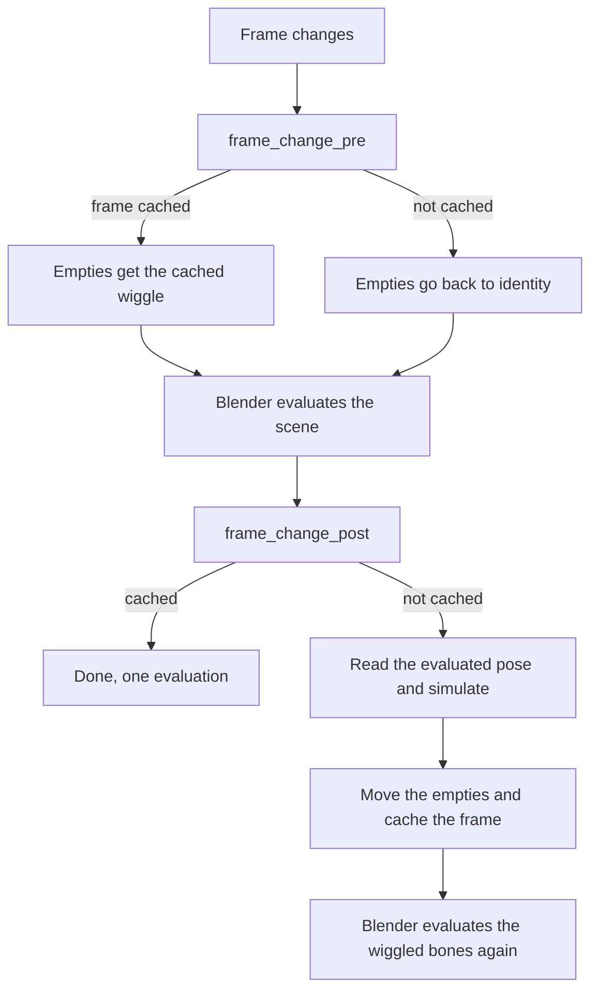

# Emil's Wiggle

My own take on [Wiggle 2](https://github.com/shteeve3d/blender-wiggle-2) by Steve Miller. Same spring physics on bones, but it works live in renders (no more baking just to hit F12), it's a LOT faster, and you can tweak or freeze each axis.

It started because the ears and tail on Kita'vali kept doing weird stuff. First the timing was off, then renders didn't match the viewport, and then muting every armature still somehow ate a third of my framerate xD So yeah, I took it apart.

Built for **Blender 3.6 LTS**. It's its own add-on and doesn't touch Emil's Mesh Toolkit at all, they just live in the same repo.

## Install

Zip the `EmilsWiggle` folder (leave `tests` out if you want, Blender doesn't care), then Edit > Preferences > Add-ons > Install and turn on **Emil's Wiggle**. You'll find it in the 3D View sidebar, in the **Emil** tab.

If Wiggle 2 is still installed, turn it off. The panel warns you when both are on for the same scene, since two sims fighting over the same bones isn't fun.

Got a file that already uses Wiggle 2? There's an **Import Wiggle 2 Settings** button. It shows up by itself when the file has Wiggle 2 bones, and it copies everything over (stiffness, colliders, head/tail, mutes...) and switches Wiggle 2 off for that scene.

## Using it

Pretty much like Wiggle 2. Turn the scene on, select an armature, pick a pose bone and tick **Tail** (the bone swings) or **Head** (the bone moves, only on bones that aren't connected). Changing a value changes it on every selected bone too, you can turn that off in Utilities.

Then just hit play.

### Per axis values and locks

Every Tail/Head section has a **Per Axis** toggle. Turn it on and Stiff, Damp and Gravity become X/Y/Z values in the bone's local space (it starts from whatever single value you had, so nothing jumps).

**Lock Axis** freezes motion along a local axis. For a tail that's X and Z (Y is along the bone, that's what Stretch is for). So an ear that should only flop sideways? Lock one axis and done. Turn on the bone axes display in the armature properties if you're not sure which one is which, bone roll decides it.

### Rendering without baking

This is the big one. F12, Ctrl+F12 and command line renders all run the wiggle for real now, and they match the viewport exactly.

The easy way: play your animation once (or click **Simulate Range**), then render. Every simulated frame is cached, so the render just reuses them, and a single F12 on frame 87 shows exactly what you saw on frame 87. If a frame isn't cached, an animation render simulates it on the spot, frame after frame.

**Lock Cache** keeps the cached frames even if you edit stuff afterwards. Simulate Range locks it for you. When the cache is unlocked, editing the animation, the rig or a collider clears it, so you never render something stale.

Wiggle turns on **Render > Lock Interface** when you enable a scene, and the panel yells if it gets turned off. Keep it on, it stops the viewport from touching the scene while the render thread moves bones.

**Bake to Keyframes** is still there in Utilities if you want real keys (for exporting, say), it's just not needed for renders anymore.

### Loops

With **Loop Physics** on, the sim keeps going when the timeline wraps around instead of snapping back. Once a loop plays out the same as the one before, playback just replays the cache from then on, so a settled loop costs almost nothing. **Preroll** runs some frames before the start so things are already settled, and with Loop Physics it prerolls the end of your loop, which is what you want for seamless cycles.

### Speed stuff

**Fast Preview** (on by default) is for viewport playback. It shows each frame's wiggle one frame late, and in exchange Blender only has to evaluate your scene once per frame instead of twice. The physics itself is still exact, and paused frames, scrubbing to cached frames and renders are always exact too. You won't notice the delay on ears and hair, honestly. If a rig can't do it (other constraints on the wiggle chain, bones that don't inherit rotation or scale fully), it just quietly uses the normal mode.

**Substeps** splits each frame into smaller physics steps. Useful for very stiff springs or fast motion, costs a bit more.

Here's what I measured on a test scene (3 armatures with 20 wiggle bones each, subdivided meshes deformed by them, Blender 3.6, 120 frames):

| | Wiggle 2 | Emil's Wiggle |
|---|---|---|
| Scene off | 87 fps | 87 fps |
| All armatures muted | 48 fps | 97 fps |
| Wiggling | 25 fps | 42 fps |
| Wiggling, Fast Preview | | 78 fps |
| Replaying the cache | | 88 fps |

## What got fixed

The stuff I tracked down in Wiggle 2 2.2.4, for the curious:

- **Timestep ignored `fps_base`.** It used `1 / fps`, so a scene set to 3 fps with a base of 0.1 (which is 30 fps) simulated with a timestep ten times too big. It's `fps_base / fps` now.
- **Muted things still cost a lot.** Every frame it reset every muted bone (each property write makes Blender re-evaluate the armature and redraw the whole window) and then forced a full extra scene evaluation. Muted or disabled now means zero work.
- **The simulation lived in bone properties.** Positions and velocities were custom properties, so every write re-evaluated the armature, and writing the collision object pointer rebuilt the whole dependency graph, every frame. It's plain Python now.
- **Renders needed a bake.** Wiggle 2 switched itself off while rendering. Turning it on wouldn't have been enough anyway, see "How it works". Colliders, wind and pin targets are also read from the evaluated scene now, so they're right during renders too.
- **Scaled armatures wiggled wrong.** The spring target ignored the object scale, so an armature at 0.01 scale (hello FBX imports) behaved completely differently. It's scale independent now.
- **Swings could twist or flip.** The swing used a track rotation with Z as the up axis, which breaks down when the tail swings toward local Z. It uses the shortest rotation now.
- **You couldn't pose wiggle bones.** Their loc/rot/scale got reset every frame. Now they're never touched.
- **Frame jumps glitched.** Jumping more than 4 frames stepped the sim once with a normal timestep, so it popped. Jumps now use the cache or restart cleanly, small skips are simulated properly.
- **Preview range and loops.** Looping used the scene range even with a preview range on.
- **Mesh colliders without faces** make Blender's nearest point lookup throw, which stopped the whole sim every frame. They're skipped now, and one broken rig can't stop the others anymore.
- **Multiple scenes.** Some of it read `bpy.context.scene` instead of the scene the handler was called for.

## How it works

Each wiggling bone gets a **Copy Transforms** constraint called "Emil's Wiggle", first in its stack, pointing at a hidden empty (they live in a collection called `EmilsWiggle Helpers` that isn't in any scene, so exporters don't see them). The sim only ever moves those empties.

Why not just write the bone rotation like Wiggle 2? I found out the hard way xD When a frame handler writes pose channels during a render, Blender has to copy the armature again for the render, and in 3.6 that copy loses the animated values and the object's world matrix (the backup code for that is literally switched off). So the render showed the chain wiggling in the wrong place. Moving a separate empty never re-copies the armature, and the renders match the viewport exactly.



The same code runs in the viewport and on the render thread, it only ever uses the scene and depsgraph Blender hands to the handlers. The code is split up like this:

| File | What's in it |
|---|---|
| `solver.py` | The physics (springs, stretch, chains, collisions, pins, per axis, locks) |
| `runtime.py` | Rigs, the frame logic, the cache, the constraints and empties |
| `props.py` | Every setting, saved in the .blend and library overridable |
| `handlers.py` | Blender app handlers |
| `operators.py` | Buttons: reset, simulate, bake, copy, select, import |
| `ui.py` | The sidebar panels |

## Tests

There's a headless test suite that builds rigs, plays them, renders with Cycles and Workbench, saves and reloads, bakes and draws every panel:

```bash
blender -b --factory-startup --python EmilsWiggle/tests/run_tests.py -- result.txt
```

It writes the results to `result.txt` (and a log next to it). Last run: 68 passed on Blender 3.6.23.

Background mode can't do real playback or threaded renders, so there's a second one that opens its own Blender window, plays, stops, does a Ctrl+F12 with and without the cache plus an F12, checks everything and quits by itself (12 passed last time):

```bash
blender --factory-startup --no-window-focus --python EmilsWiggle/tests/run_gui_tests.py -- gui_result.txt
```

## Known limits

- The cache lives in memory, so after reopening a file you need to play or Simulate Range again before rendering a single frame from the middle. Animation renders are fine either way.
- Linked armatures need a library override (Blender won't let anything add constraints otherwise).
- Fast Preview is viewport playback only, on purpose.

## Credits

Physics and the original idea by Steve Miller ([Wiggle 2](https://github.com/shteeve3d/blender-wiggle-2)). Rewritten and fixed up by Emil. Licensed GPL-3.0 like the original, see `LICENSE`.
